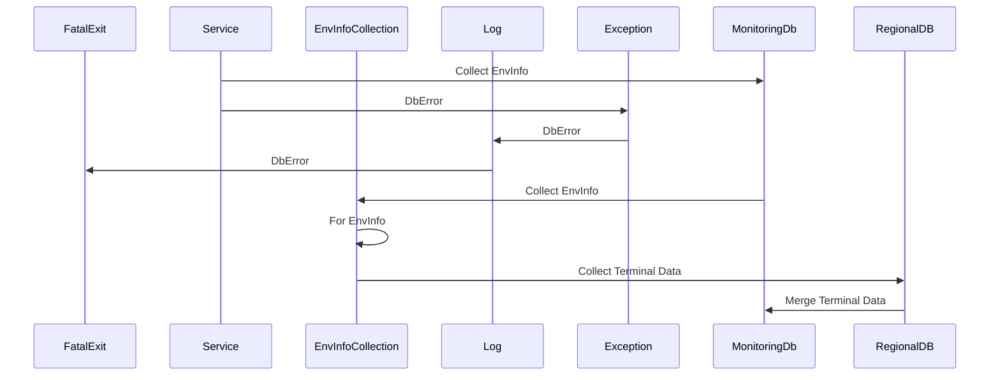

# TerminalCrawler

### Краткое описание сервиса
Микросервис для сбора информации о терминалах:
1. Регион
2. Номер ОПС
3. Номер терминала
4. Дата посленей активности
5. Статус

Статус определяется исходя из наличия каких либов логов работы за последние два месяца.

**Схема взаимодействия:**

### Структура хранения данных

Название поля | Тим данных | Описание | Нулевое значение
 --- | --- | --- | ---
RegionId | nvarchar(6) | ID региона | Нет
StoreId | nvarchar(6) | Номер ОПС | Нет
TerminalId | nvarchar(20) | Номер терминала | Нет
LastActionDateTime | datetime | Дата посленей активности | Да

**Сборка:**
 - Сборка на Windows: `go build -mod vendor -o terminalcrawler.exe`
 - Сборка на Linux: `go build -mod vendor -o main`

**Запуск:**

Сервис можно запускать на платформах:
 - Linux (тестирование проводилось на Ubuntu 20.04)
 - Windows (тестирование проводилось на Windows 10 и Windows Server 2012R2)

 ***Параметры запуска на разных ОС:***
  - **Windows:**
  1. Запуск на ОС семейства Windows может производиться на машине расположенной в домене или вне домена с указанием логина и пароля в виде переменных окружения: `USER_NAME` и `USER_PASSWORD` 
  2. Запуск на ОС семейства Windows может производиться на машине расположенной в домене. Требутеся чтобы у пользователя под которым запускается сервис был доступ к БД указанной в настройках. Логин и пароль в таком случает не требется так как используется доменная авторизация.
  Сервис можно запускать как Windows-службу.
  - **Linux:**
  Запуск на ОС семейства Linux может производиться как в рамках запуска приложения так и демона. Для запуска необходимо указать переменные окружения: `USER_NAME` и `USER_PASSWORD` 

 ***Описание файла конфигурации сервиса:***
 - `"service_name":` - Имя сервиса
 - `"display_name":` - Отображаемое имя сервиса
 - `"service_description":` - Описание сервиса
 - `"monitoringDb.server":"` - Сервер БД мониторинга
 - `"monitoringDb.dbName":"` - Имя БД мониторинга
 - `"collectTerminalQuery":` - SQL-запрос сбора информации о терминала и мерджа в БД мониторинга
 - `"getEnvInfoQuery":` - SQL-запрос получения информации о регионах из таблицы EnvInfo
 - `"cronTime":` - крон-расписание формата "* * * * * *"

**Инструменты:**

*[ссылки на инструменты, с помощью которых собирается описываемый проект, ссылка на проект или проекты в системе управления проектами со списком задач и изменений]*

- [Go v.1.16.4](https://golang.org/)
- [Go MSSQL driver](https://pkg.go.dev/github.com/denisenkom/go-mssqldb)
- [Go Service](https://github.com/kardianos/service)
- [Go Quartz](https://github.com/reugn/go-quartz)

**Окружение:** 
- [Microsoft SQL Server 2012](https://www.microsoft.com/)
- [Ubuntu 18.04](https://releases.ubuntu.com/18.04/) >= 18.04 или [MS Windows Server](https://www.microsoft.com/) >= 2012 R2
- [Docker](https://www.docker.com/)

**Features**
* [X] Сделать первую сборку
* [X] Подготовиться к деплою в Docker
* [X] Сделать кросплатформенную сборку
* [ ] Добавить расширенное логирование
